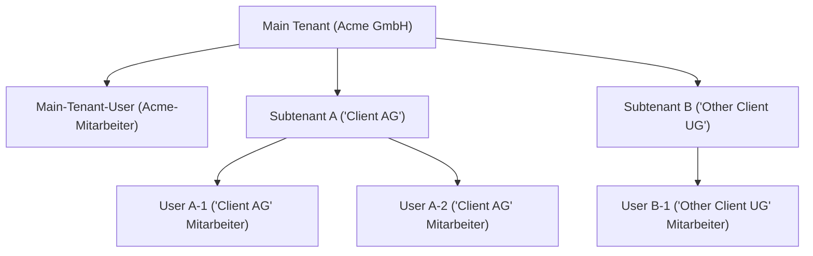

# Subtenancy in KNOWRON

## 1. Zweck
Subtenancy ermöglicht es unseren **Main Tenants** (Primärkunden), ihren **Subtenants** (Kunden) einen gebrandeten Self-Service-Zugang zu geben und gleichzeitig sensible Daten zu schützen. Mit Subtenancy können Kunden KNOWRON **white-labeln**, weiterverkaufen oder Endkunden einfach in einen kontrollierten Arbeitsbereich einladen – ganz ohne zusätzlichen IT-Aufwand.  

Subtenants erhalten **vollen Zugriff auf alle KNOWRON-Funktionen** für ihre eigenen Produkte und Maschinen, verfügen jedoch nur über Lesezugriff auf Inhalte, die ihre Main Tenants ausdrücklich freigegeben haben.

Konkret ermöglicht Subtenancy:  

- **Self-Service:** Subtenants lösen Routineprobleme mithilfe öffentlicher Dokumente selbst und reduzieren so Support-Tickets.  
- **Datensouveränität:** Alles, was ein Subtenant erstellt, ist automatisch nur für diesen Subtenant sichtbar.  
- **Mühelose Skalierung:** Main Tenants können dutzende Kunden onboarden, ohne neue Tenants anlegen zu müssen.  

| Akteur | Bedeutung in KNOWRON |
|--------|----------------------|
| **Main Tenant** | Ihre Organisation. Sie besitzen die Daten und entscheiden, was **Public** bzw. **Private** ist. |
| **Subtenant** | Ihr Kunde. Arbeitet in einem eigenen, sicheren Bereich, sieht aber Ihre als **Public** markierten Daten. |
| **User** | Ein individueller Account unter einem Main Tenant oder Subtenant. |

<em>Weißgelabelte Lösung für Acme GmbH (Main Tenant), die Client AG (Subtenant) Zugang zu ihrer Instanz gewährt hat, in der sowohl Acme- als auch Client-AG-Maschinen verfügbar sind.</em>

### Praxisbeispiel

1. **Main Tenant** „Acme GmbH“ lädt das „Placement-Machine-X-Wartungshandbuch“ zu seinem Produkt „Placement Machine X“ hoch und markiert es als **Public**.  
2. **Subtenant** „Client AG“, die eine Placement Machine X erworben hat, erhält Subtenant-Zugang für Self-Service. Das Handbuch erscheint (weißgelabelt) in ihrer KNOWRON-Wissensdatenbank unter dem entsprechenden Produkt.  
3. **Subtenant** „Client AG“ stellt dem System eine Support-Frage; der KI-Assistent antwortet aus dem Handbuch und anderen öffentlichen Quellen.  
4. Als **Private** gekennzeichnete Dokumente, wie interne Reparaturanweisungen, bleiben ausschließlich für den Main Tenant sichtbar.  

### Wer kann was?

| Fähigkeit | Main Tenant | Subtenant |
|-----------|-------------|-----------|
| Produkte erstellen, bearbeiten oder löschen | ✅ | ✅ |
| Maschinen erstellen, bearbeiten oder löschen | ✅ | ✅ (unter eigenen *oder* Main-Tenant-Produkten) |
| Produktionslinien erstellen, bearbeiten oder löschen | ✅ | ✅ |
| Artikel, Tutorials oder Logbucheinträge erstellen, bearbeiten oder löschen | ✅ | ✅ (nur unter eigenen Produkten) |
| Dokumentation hochladen, bearbeiten oder löschen | ✅ | ✅ |
| Public / Private umschalten | ✅ | ❌ (alles ist implizit privat) |
| Weitere Benutzer auf die Plattform einladen (nur eigene Kunden) | ✅ | ✅ |

### Wie funktioniert die Sichtbarkeit?

| Eigentümer | Sichtbarkeits-Flag | Sichtbar für |
|------------|-------------------|--------------|
| Main Tenant | **Public** | Main Tenant **+ alle Subtenants** |
| Main Tenant | **Private** | Nur Main Tenant |
| Subtenant | *(implizit)* Private | Nur dieser Subtenant |

---

## Zusammenfassung
Subtenancy in KNOWRON bietet das perfekte Gleichgewicht: Sie behalten die Kontrolle, Ihre Kunden werden befähigt – und alle profitieren. Bereit, Subtenancy freizuschalten? **Kontaktieren Sie noch heute unser Sales-Team.**