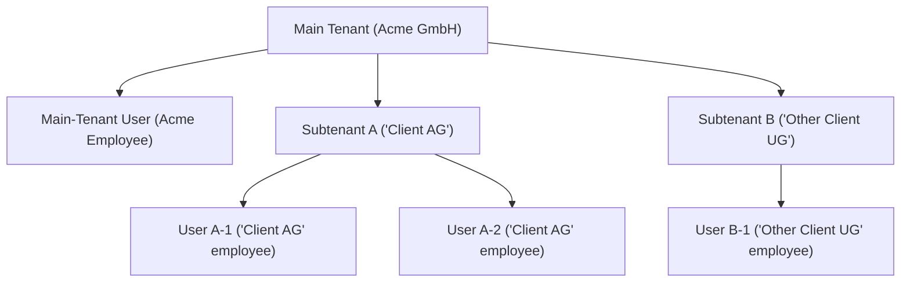

# Subtenancy in KNOWRON

## What is subtenancy?
Subtenancy lets our primary customers (**Main Tenants**) give branded, self-service access to their own customers (**Subtenants**) while keeping sensitive data protected. With subtenancy, clients can **white-label** KNOWRON, resell it, or simply invite end-customers into a controlled workspace—all without extra IT overhead. 

<em>Whitelabeled solution for Acme GmbH (main tenant), which has given Client AG (subtenant) access to their own instance, where both Acme GmbH and Client AG machines are available.</em>

Subtenants receive **full access to all KNOWRON features** for their own products and machines, while maintaining restricted read-only rights to the content their main tenants have decided should be visible.

Specifically, subtenancy enables: 

- **Self-Service:** Subtenants resolve routine issues with Public docs, slashing support tickets.  

- **Data Sovereignty:** Anything a Subtenant creates is automatically private to that Subtenant.

- **Effortless Scaling:** Main Tenants can onboard dozens of customers without new tenant setups.

| Actor | What it means in KNOWRON |
|-------|--------------------------|
| **Main Tenant** | Your organisation. You own the data and decide what’s Public vs. Private. |
| **Subtenant** | Your customer. Works in its own secure space but sees your data marked as **Public**. |
| **User** | An individual account under either a Main Tenant or a Subtenant. |

### Practical Example

1. **Main Tenant** 'Acme GmbH' uploads the “Placement Machine X Maintenance Manual” to their product "Placement Machine X" and marks it as **Public**.  
2. **Subtenant** 'Client AG', who has bought a Placement Machine X , receives subtenant access for self-service. The manual appears in its KNOWRON knowledge base (whitelabeled), under the appropriate product.  
3. **Subtenant** 'Client AG' asks a support question to the system; the AI assistant answers from the manual and other public sources.  
4. Documents marked as **Private** such as internal repair procedures stay visible only to the Main Tenant.

### Who can do what?
| Capability | Main Tenant | Subtenant |
|------------|-------------|-----------|
| Create, edit or delete products | ✅ | ✅ |
| Create, edit or delete machines | ✅ | ✅ (under own *or* Main-Tenant products) |
| Create, edit or delete production lines | ✅ | ✅ |
| Create, edit or delete articles, tutorials or logbook entries | ✅ | ✅ (only under own products) |
| Upload, edit or delete documentation | ✅ | ✅ |
| Toggle Public / Private | ✅ | ❌ (everything is implicitly private) |
| Invite other users to the platform (only to their clients) | ✅ | ✅ |

### How does visibility work?
| Owner | Visibility Flag | Visible To |
|-------|-----------------|------------|
| Main Tenant | **Public** | Main Tenant **+ all its Subtenants** |
| Main Tenant | **Private** | Main Tenant only |
| Subtenant | *(implicit)* Private | That Subtenant only |

---

Subtenancy in KNOWRON gives you the perfect balance: you stay in control, your customers stay empowered, and everyone wins. Ready to unlock subtenancy? **Contact our Sales team today.**
